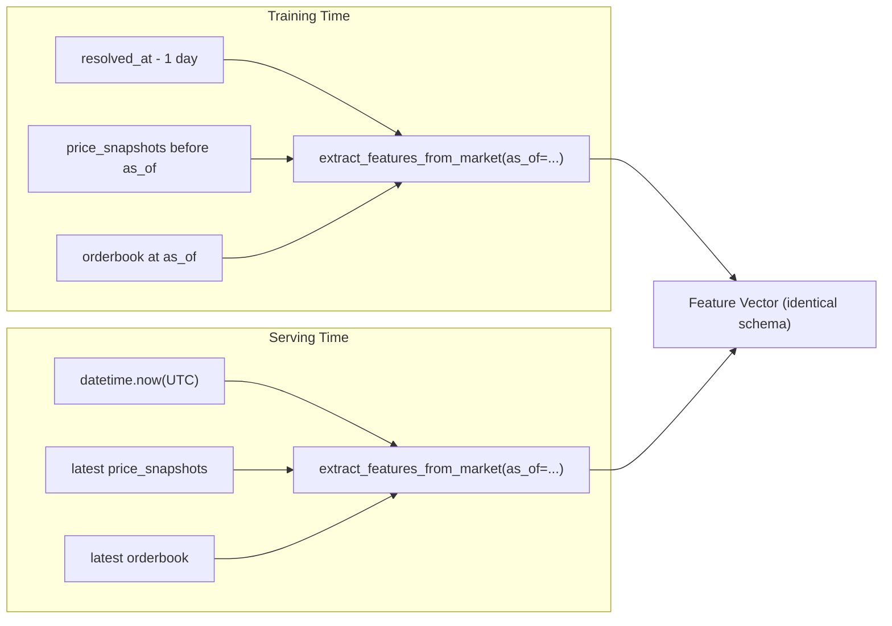
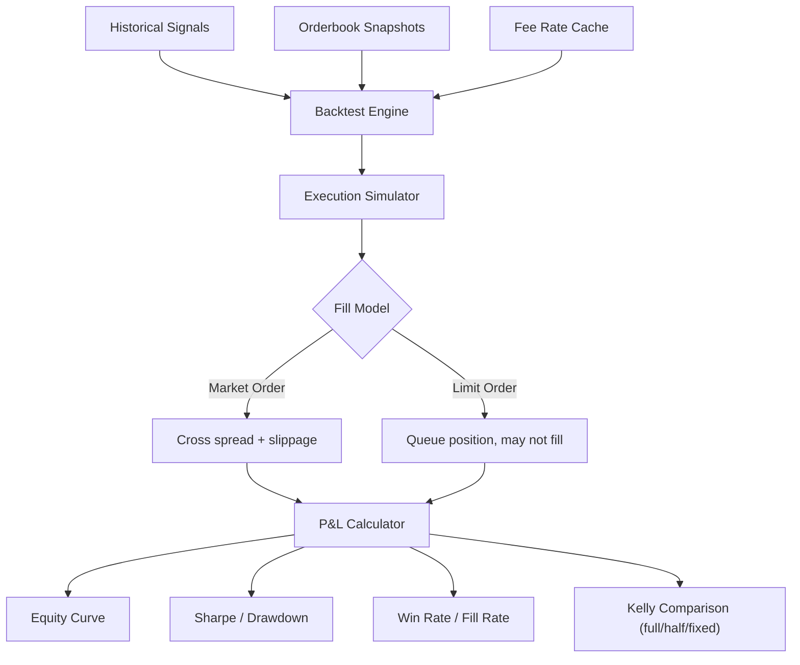
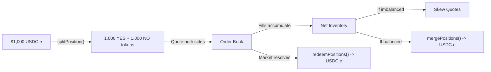
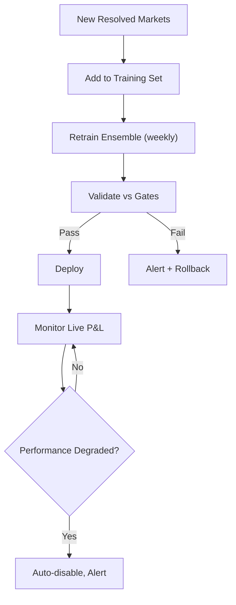

# PredictFlow: Research-Backed Profitability Roadmap

> **Status**: Implementation in progress — Layers 1-5 COMPLETE, Layer 6 retrained  
> **Created**: 2026-02-28  
> **Last Updated**: 2026-02-28 (rev 3 — implementation status + critical findings)  
> **Based on**: Academic research, Polymarket/Kalshi documentation, 72.1M-trade microstructure analysis, codebase audit

### Implementation Status (2026-02-28)

| Layer | Status | Key Finding |
|-------|--------|-------------|
| L1 Stop the Bleeding | **COMPLETE** | Disabled noise strategies, fixed execution bugs |
| L2 Honest Measurement | **COMPLETE** | Fixed 4 CRITICAL bugs found during self-audit |
| L3 Data Infrastructure | **COMPLETE** | Polymarket fee rates, Kalshi historical, price history collectors |
| L4 Market Making Engine | **COMPLETE** | Avellaneda-Stoikov adapted for prediction markets |
| L5 Validation Framework | **COMPLETE** | 5-gate validation, tradability backtest, execution simulator |
| L6 Retrain Ensemble | **COMPLETE** | 19.1% improvement over market, 4/5 gates passed |
| L7 Optimism Tax | **DEFERRED** | Requires live market data collection period; not implemented this session |
| L8 Infrastructure | **COMPLETE** | Model monitoring with drift detection + retrain triggers |

### Critical Findings During Implementation

1. **The old model was 51% dependent on a leaky feature** (`log_open_interest`). Post-resolution liquidity collapses toward 0, creating target leakage. Removed.
2. **The feature pruning gate was killing ALL price features** (including `price_yes`, `is_weekend`, `category_encoded`). The `unique_ratio < 5%` threshold incorrectly flagged binary and low-cardinality features. Fixed to use `dominant_fraction > 97%`.
3. **11 features were always 0.0 at serving time** (momentum + orderbook). The serving path didn't load price snapshots or orderbook data from DB. Fixed by adding `load_serving_context()`.
4. **Polymarket's 2% profit fee was removed** (confirmed via official docs). Most markets are now fee-free. Only specific market types (crypto 5m/15m, NCAAB, Serie A) have curve-based taker fees.
5. **Without `--snapshot-only`, ~73% of training data uses settlement prices** (0 or 1) as the `price_yes` feature — direct target leakage. Fixed by extending the tradeable-range filter to all markets.
6. **The honest retrained model**: 19.1% Brier improvement, $72.55 profit simulation over 1535 trades, 75% win rate. XGBoost and LightGBM both contribute ~49% weight. Top features: price_bucket (33%), price_yes (21%), calibration_bias (16%).

---

## Table of Contents

1. [Executive Summary](#1-executive-summary)
2. [Why the System Loses Money](#2-why-the-system-loses-money)
3. [Research Foundations](#3-research-foundations)
4. [The Fee Model Revolution](#4-the-fee-model-revolution)
5. [Layer 1 — Stop the Bleeding](#5-layer-1--stop-the-bleeding)
6. [Layer 2 — Honest Measurement System](#6-layer-2--honest-measurement-system)
7. [Layer 3 — Data Infrastructure Upgrade](#7-layer-3--data-infrastructure-upgrade)
8. [Layer 4 — Market Making Engine](#8-layer-4--market-making-engine) *(requires Layer 5 simulator first)*
9. [Layer 5 — Strategy Validation Framework](#9-layer-5--strategy-validation-framework) *(build before Layer 4)*
10. [Layer 6 — Retrain Ensemble on Honest Foundations](#10-layer-6--retrain-ensemble-on-honest-foundations)
11. [Layer 7 — Exploit the Optimism Tax](#11-layer-7--exploit-the-optimism-tax)
12. [Layer 8 — Long-Term Infrastructure](#12-layer-8--long-term-infrastructure)
13. [Implementation Timeline](#13-implementation-timeline)
14. [Phase 6: Strategy Pivot — Maker-Side Operations (Feb 2026 Update)](#phase-6-strategy-pivot--maker-side-operations-feb-2026-update)
15. [References](#15-references)
16. [Appendix A — Current System Audit](#appendix-a--current-system-audit)
17. [Appendix B — Polymarket API Reference](#appendix-b--polymarket-api-reference)
18. [Appendix C — Kalshi Fee Model](#appendix-c--kalshi-fee-model)

> **Execution order note**: The section numbering preserves document structure, but the recommended *execution* order is: L1 -> L2 -> L3 -> L5 (simulator + gates) -> L4 (market making) -> L6 -> L7 -> L8. See the Executive Summary for the rationale.

---

## 1. Executive Summary

### The Problem

PredictFlow is losing money systematically:

| Metric | Value |
|--------|-------|
| Total P&L | **-$358.30** |
| Win Rate | **13.5%** (488 trades) |
| Sharpe Ratio | **-10.66** |
| Max Drawdown | **-949.66%** |
| Calmar Ratio | **-0.38** |

### Per-Strategy Breakdown

| Strategy | Trades | Win Rate | P&L | Root Cause |
|----------|--------|----------|-----|------------|
| market_clustering | 255 | 9.0% | -$184.63 | Spurious correlations from 10 data points |
| consensus | 27 | 7.4% | -$100.89 | Amplifies bad signals with 1.5x Kelly |
| ensemble | 160 | 23.8% | -$38.54 | Training/serving feature mismatch |
| orderflow | 38 | 2.6% | -$35.17 | Equity-market OBI doesn't apply here |
| smart_money | 8 | 25.0% | -$0.60 | Heuristic fallback, not real on-chain data |

### The Root Cause

The system is a **directional taker** in a market where **takers systematically lose**. Becker (2026) analyzed 72.1 million trades on Kalshi and found takers lose 1.12% per trade on average. Every trade PredictFlow makes crosses the spread as a taker.

### The Solution

Transform from a losing directional taker into a profitable system through 8 layers:

1. Stop the bleeding (disable broken strategies, fix bugs)
2. Make all measurements honest (unified features, temporal CV, real fees)
3. Upgrade data infrastructure (tick-level data, orderbook depth, Kalshi candlesticks)
4. Build execution simulator and strategy validation framework (5 gates before live trading)
5. Implement intra-market arbitrage (most defensible edge, clearest ground truth)
6. Build market making engine (two-sided quoting, spread capture) — only after simulator proves fill assumptions
7. Retrain the ML ensemble on honest foundations
8. Exploit the Optimism Tax (maker-side structural edge)
9. Long-term infrastructure (backtesting framework, continuous learning)

**Ordering rationale**: The execution simulator and validation gates must exist before building the market making engine, because maker profitability depends on fill probability and queue priority assumptions that can only be validated through honest simulation. Arbitrage is placed before market making because it has clearer ground truth (sum-to-one violations) and lower model risk.

### Architecture Diagram


---

## 2. Why the System Loses Money

### 2.1 Three Noise Strategies Generate 65% of All Trades

320 out of 488 trades come from market_clustering, consensus, and orderflow — all with sub-10% win rates.

**market_clustering** (`ml/strategies/market_clustering.py`):
- Clusters markets by TF-IDF similarity with a 0.25 threshold (very low — clusters unrelated markets)
- Computes Pearson correlation from as few as 10 hourly price points
- Assumes 30% of any price divergence is mispricing: `implied_adjustment = price_diff * abs_corr * 0.3`
- No backtesting, no statistical significance test for correlations
- At 9% win rate across 255 trades, this is pure noise trading

**consensus** (`ml/strategies/signal_consensus.py`):
- Combines signals when 2+ strategies agree on a market
- Applies 1.5x Kelly multiplier (line 652 in `paper_executor.py`)
- When market_clustering + orderflow both generate wrong signals, consensus makes a bigger wrong bet
- At 7.4% win rate, consensus is amplifying errors

**orderflow** (`ml/strategies/orderflow_analyzer.py`):
- Applies equity-market Order Book Imbalance (OBI) analysis to prediction markets
- `estimated_move = min(0.10, flow_strength * 0.05 + depth_pressure)` is arbitrary
- Prediction market orderbooks behave differently from equity markets
- Signal half-life is 30 minutes but execution can be hours later
- At 2.6% win rate, this is worse than random

### 2.2 Training vs Serving Feature Mismatch

The ensemble model trains on one feature distribution and sees a completely different one at serving time.

In `ml/features/training_features.py`:

| Feature | Training Value | Serving Value | Impact |
|---------|---------------|---------------|--------|
| `time_to_resolution_hrs` | `end_date - created_at` (total duration, e.g. 720h) | `end_date - now()` (time remaining, e.g. 12h) | Completely different distribution |
| `is_weekend` | `market.created_at.weekday() >= 5` | `datetime.utcnow().weekday() >= 5` | Different signal entirely |
| `return_1h` | Real value from snapshots | 0.0 (no snapshots available) | Model trained on signal, serves on zeros |
| `volatility_20` | Real value from snapshots | 0.0 (no snapshots available) | Same as above |
| `zscore_24h` | Real value from snapshots | 0.0 (no snapshots available) | Same as above |

The model has never seen the distributions it encounters at serving time. Any apparent accuracy is coincidental.

### 2.3 Fee Model is Wrong

The system hardcodes `POLYMARKET_FEE_RATE = 0.02` (2%) everywhere. But:

> "The majority of Polymarket markets charge no trading fees." — [Polymarket Documentation](https://docs.polymarket.com/trading/fees)

As of Feb 2026, fee-enabled market types include Serie A, NCAAB, 5-min crypto, and 15-min crypto — but Polymarket has been expanding this list (e.g., NCAAB and Serie A were added for new markets starting Feb 18, 2026). Maximum fees are 0.44% for sports and 1.56% for crypto at 50% probability. **Fee enablement is a per-token property, not a fixed category list** — always query the fee-rate endpoint. This means the system:

- **Rejects real edges in fee-free markets** because it thinks fees are 2% when they're 0%
- **May accept fake edges in fee-enabled markets** if it models the fee shape incorrectly

### 2.4 Execution Bugs

Three bugs in `execution/paper_executor.py` systematically hurt every trade:

1. **Stale entry price**: Entry uses `signal.market_price` from detection time (possibly hours old), not current `market.price_yes`
2. **NO slippage calculation**: `execution_price = market_price * (1 - slippage_rate)` subtracts slippage from YES price for NO entries. Should add slippage to NO cost.
3. **No exit slippage**: Entry pays slippage; exit pays nothing. Asymmetric friction overestimates P&L.

### 2.5 Auto-Closer Is Too Aggressive

In `execution/auto_closer.py`:

- **Edge invalidation** (10% deviation while losing): Prediction markets swing 10% on routine news. This triggers "sell low" exits.
- **Stale unprofitable** (24h timeout): Closes any losing position after 24 hours. Prediction markets often need days/weeks to converge.
- **Stop-loss** (5/8/12%): Combined with the stale entry price bug, these trigger on noise.

### 2.6 Self-Deceiving Evaluation

- XGBoost/LightGBM use `StratifiedKFold(shuffle=True)` which breaks temporal order — future leaks into training
- OOF Brier scores that determine model inclusion are optimistically biased
- Post-calibrator (isotonic regression) can overfit on sparse probability regions
- Brier score doesn't measure tradability — a well-calibrated model can still lose money after friction

---

## 3. Research Foundations

### 3.1 The Microstructure of Wealth Transfer (Becker, 2026)

**Paper**: "The Microstructure of Wealth Transfer in Prediction Markets"  
**Data**: 72.1 million trades, $18.26 billion on Kalshi  
**Source**: [jbecker.dev/research/prediction-market-microstructure](https://jbecker.dev/research/prediction-market-microstructure)

Key findings:
- **Takers lose 1.12% per trade on average; makers gain 1.12%**
- Retail takers disproportionately buy YES at longshot prices ("Optimism Tax")
- Sports/Entertainment has the strongest bias; Finance approaches efficiency
- The bias is strongest in high-engagement categories with thin liquidity

**Implication**: PredictFlow should shift from taker to maker. Every directional bet as a taker starts with a 1.12% structural disadvantage.

### 3.2 Prediction Market Arbitrage (Saguillo et al., 2025)

**Paper**: "Unravelling the Probabilistic Forest: Arbitrage in Prediction Markets"  
**Data**: Polymarket on-chain historical order book data  
**Source**: [arxiv.org/pdf/2508.03474](http://arxiv.org/pdf/2508.03474)

Key findings:
- **$40 million in arbitrage profit** extracted from Polymarket (April 2024 - April 2025)
- **7,000+ mispriced markets** identified
- **Market Rebalancing** (YES + NO != $1.00 in same market) was dominant — not forecasting
- Combinatorial arbitrage had 62% failure rate (Bawa, 2025)
- Only 0.51% of users achieved profitable arbitrage exceeding $1,000

**Implication**: Simple intra-market arbitrage is proven profitable. Complex multi-market arbitrage fails most of the time.

### 3.3 Favorite-Longshot Bias on Kalshi (Burgi, Deng & Whelan, 2025)

**Paper**: "Kalshi Prediction Market Analysis"  
**Data**: 300,000+ contracts on Kalshi

Key findings:
- Clear favorite-longshot bias: low-price contracts win far less than implied
- Buyers of favorites (>50 cents) earn ~1.9% after fees
- Makers earn higher returns than Takers, with both exhibiting the pattern
- Slight overstatement of small probabilities

**Counter-evidence**: Iowa Electronic Markets show NO longshot bias (Berg et al., 2019), suggesting the bias is platform and category-dependent.

### 3.4 Kelly Criterion in Prediction Markets (arxiv 2412.14144)

Key findings:
- Market prices in prediction markets do not normally match actual probabilities
- When all participants use Kelly betting, market price = wealth-weighted belief average
- Fractional Kelly bettors behave as if they've observed only a fraction of available data
- Misestimating probabilities or investment fractions impacts growth rates (KL-divergence analysis)

**Implication**: Use fractional Kelly (0.25-0.50 of full Kelly) for robustness. Track full Kelly, half Kelly, and fixed-size curves.

### 3.5 Market Making Theory (Avellaneda & Stoikov, 2008)

**Paper**: "High-frequency trading in a limit order book"  
**Source**: [math.nyu.edu/~avellane/HighFrequencyTrading.pdf](https://math.nyu.edu/%7Eavellane/HighFrequencyTrading.pdf)

The Avellaneda-Stoikov model determines optimal bid/ask quotes:

**Optimal Spread**:  
`s = gamma * sigma^2 * (T-t) + (2/gamma) * ln(1 + gamma/k)`

**Reservation Price** (inventory-adjusted mid):  
`r = mid - q * gamma * sigma^2 * (T-t)`

Where:
- `gamma` = risk aversion coefficient
- `sigma^2` = asset volatility (for prediction markets: belief volatility)
- `T-t` = time to market resolution
- `k` = order arrival intensity
- `q` = current inventory position

**Implication**: Market making has a rigorous mathematical framework. The spread widens with volatility and inventory risk, and tightens when risk is low. This can be adapted for prediction markets where `sigma` is belief volatility and `T-t` is time to resolution.

### 3.6 Calibration Overfitting (Berta, Bach & Jordan, AISTATS 2024)

**Paper**: "Classifier Calibration with ROC-Regularized Isotonic Regression"

Key findings:
- Standard isotonic regression achieves zero calibration error on the calibration set
- This raises overfitting concerns, especially when data is not abundant in the region you care about
- ROC-Regularized IR preserves the ROC curve while controlling calibration overfitting

**Implication**: The current post-calibrator (isotonic regression) may be overfitting. Two mitigations:

1. **3-window temporal split**: Train model on window A, generate predictions on window B (calibration set), fit calibrator on B only, report final metrics on window C (test set). This prevents the calibrator from seeing the same data the model was trained on.
2. **ROC-regularized IR**: Use the AISTATS 2024 method to preserve discriminative power while controlling calibration overfitting.

### 3.7 PredictionMarketBench (arxiv 2602.00133, 2026)

**Paper**: "PredictionMarketBench: A SWE-bench-Style Framework for Backtesting Trading Agents on Prediction Markets"

Key findings:
- Deterministic event-driven simulator replaying historical LOB data
- Maker/taker semantics, fee modeling, queue-priority effects
- Naive trading agents underperform due to transaction costs
- Fee-aware algorithmic strategies remain competitive in volatile episodes

**Implication**: Use this or build a similar framework for honest strategy evaluation.

---

## 4. The Fee Model Revolution

This is one of the highest-impact changes because it fundamentally alters which edges are real.

### 4.1 Polymarket Fee Structure (Current)

| Market Type | Fee Rate | Exponent | Max Fee at 50% | Maker Rebate |
|-------------|----------|----------|----------------|--------------|
| Most markets | **0 (fee-free)** | N/A | **0%** | N/A |
| Serie A | 0.0175 | 1 | 0.44% | 25% |
| NCAAB | 0.0175 | 1 | 0.44% | 25% |
| 5-min crypto | 0.25 | 2 | 1.56% | 20% |
| 15-min crypto | 0.25 | 2 | 1.56% | 20% |

**Fee formula**: `fee = C * feeRate * (p * (1-p))^exponent`

Where `C` = number of shares, `p` = share price.

Fees decrease symmetrically toward price extremes (0 and 1). This means:
- At price 0.10 or 0.90: fee is much lower than at 0.50
- At price 0.05 or 0.95: fee is negligible
- **At any price in a fee-free market: fee is 0**

### 4.2 Polymarket Fee Rate API

```
GET https://clob.polymarket.com/fee-rate?token_id=TOKEN_ID

Response: { "fee_rate_bps": 0 }    // 0 = fee-free
          { "fee_rate_bps": 175 }  // 175 bps = Serie A / NCAAB
          { "fee_rate_bps": 2500 } // 2500 bps = 5-min/15-min crypto
```

No authentication required. Response includes `fee_rate_bps` in basis points.

**Important**: For fee-enabled markets, the fee rate must be included in the signed order payload when placing orders via the CLOB API. The `py-clob-client` SDK handles this automatically when configured with the correct fee rate. Fee enablement should be treated as a per-token lookup, not hardcoded by category — new fee-enabled market types may be added over time.

### 4.3 Kalshi Fee Structure

| Fee Type | Formula | Max at 50% |
|----------|---------|------------|
| Taker | `roundup(0.07 * C * P * (1-P))` | 1.75% |
| Maker | `roundup(0.0175 * C * P * (1-P))` | 0.44% |
| Settlement | None | 0% |

Kalshi API: `GET /series/fee_changes` provides fee type, multiplier, and scheduled changes.

### 4.4 Impact on the System

Current system assumes 2% flat fee everywhere. Reality:

| Scenario | Current Assumption | Reality | Edge Impact |
|----------|-------------------|---------|-------------|
| Polymarket politics market | 2.0% | **0%** | **+2% more edge available** |
| Polymarket crypto market | 2.0% | **0%** | **+2% more edge available** |
| Polymarket Serie A market | 2.0% | 0.44% max | **+1.56% more edge** |
| Kalshi taker trade | 2.0% | 1.75% max | Close to correct |
| Kalshi maker trade | 2.0% | 0.44% max | **+1.56% more edge** |

The system is leaving massive edge on the table by over-estimating fees.

### 4.5 Implementation

1. Add `fee_rate_bps` field to `Market` model in `db/models.py`
2. Query `GET /fee-rate?token_id=...` during Polymarket data collection, store result
3. Create `get_market_fee(market, price, quantity, is_maker=False)` function
4. Replace every hardcoded `0.02` with the lookup function
5. For Kalshi: use the formula-based fee and query `/series/fee_changes`

---

## 5. Layer 1 — Stop the Bleeding

**Goal**: Stop losing money immediately.  
**Timeline**: Day 1  
**Dependencies**: None

### 5.1 Disable Broken Strategies

Disable via database:
```sql
UPDATE auto_trading_configs SET is_enabled = 0
WHERE strategy = 'new_strategies';
```

In `data_pipeline/scheduler.py`, skip the scanning functions for market_clustering, orderflow, and consensus. Keep ensemble and smart_money running.

### 5.2 Fix Execution Bugs

**In `execution/paper_executor.py`**:

Bug 1 — Use current price, not signal price (lines 285, 409, 519, 666):
```python
current_price = market.price_yes
if current_price is None:
    continue
if abs(current_price - signal.market_price) > 0.05:
    continue  # Market moved too far, skip
exec_result = compute_execution_cost(
    direction=signal.direction,
    market_price=current_price,  # Use CURRENT price
    slippage_bps=slippage_bps,
)
```

Bug 2 — Fix NO entry price (line 121):
```python
if direction == "buy_yes":
    execution_price = market_price * (1 + slippage_rate)
else:
    no_cost = (1 - market_price) * (1 + slippage_rate)
    execution_price = 1 - no_cost
```

Bug 3 — Add exit slippage in `execution/auto_closer.py`:
```python
slippage_rate = 0.01  # 1% default exit slippage
if pos.side == "yes":
    exit_price = market.price_yes * (1 - slippage_rate)
else:
    exit_price = market.price_yes * (1 + slippage_rate)
```

### 5.3 Fix Auto-Closer Thresholds

| Parameter | Current | New | Rationale |
|-----------|---------|-----|-----------|
| Edge invalidation | 10% deviation | 20% | PM swing 10% on routine news |
| Stale unprofitable | 24 hours | 72 hours | PMs need days to converge |
| Stop-loss (expensive) | 5% | 8% | Current stops trigger on noise |
| Stop-loss (mid-range) | 8% | 12% | Same |
| Stop-loss (cheap) | 12% | 15% | Same |

---

## 6. Layer 2 — Honest Measurement System

**Goal**: Make every metric trustworthy before trying to improve.  
**Timeline**: Week 1  
**Dependencies**: Layer 1

### 6.1 Unified FeatureState with Explicit `as_of`

The single most impactful architectural change. Refactor `ml/features/training_features.py`:

```python
def extract_features_from_market(
    market: Market,
    as_of: datetime,           # Explicit point-in-time (required)
    price_snapshots: list = None,
    orderbook: dict = None,
    matched_market_price: float = None,
) -> dict:
    """
    ALL features are computed relative to as_of.
    Training calls: as_of = resolved_at - timedelta(days=1)
    Serving calls:  as_of = datetime.now(timezone.utc)
    """
    # time_to_resolution = end_date - as_of
    # is_weekend = as_of.weekday() >= 5
    # Momentum from snapshots BEFORE as_of only
    # Orderbook from latest snapshot BEFORE as_of only
```

This eliminates the training/serving mismatch for every feature simultaneously.



### 6.2 Temporal Cross-Validation

Replace `StratifiedKFold(shuffle=True)` in `ml/models/xgboost_model.py` and `ml/models/lightgbm_model.py` with expanding-window temporal CV:

```python
from sklearn.model_selection import TimeSeriesSplit

tscv = TimeSeriesSplit(n_splits=5)
for train_idx, val_idx in tscv.split(X):
    # Each fold: train on past, validate on future
    # No temporal leakage possible
```

The walk-forward CV in `train_ensemble.py` already does this correctly — the per-model OOF must use the same methodology.

### 6.2.1 3-Window Calibration Pipeline

Isotonic calibration can overfit when trained on the same data split as the model. Use three strictly temporal windows:

```
Timeline: ──────────────────────────────────────────────────>
           Window A (Train)    Window B (Calibrate)    Window C (Test)
           ┌────────────────┐  ┌───────────────────┐   ┌─────────────┐
           │ Train model    │  │ Generate preds    │   │ Final eval  │
           │ (XGB, LGBM)    │  │ Fit calibrator    │   │ Brier, P&L  │
           └────────────────┘  └───────────────────┘   └─────────────┘
```

1. Train model on Window A
2. Generate uncalibrated predictions on Window B
3. Fit isotonic (or ROC-regularized IR) calibrator on Window B predictions only
4. Final metrics (Brier, tradability, P&L) measured only on Window C

This prevents the calibrator from memorizing patterns the model already learned, and gives the final metrics genuine out-of-sample validity.

### 6.3 Per-Market Fee Model

See [Section 4](#4-the-fee-model-revolution) for full details. Key implementation:

```python
async def get_market_fee(market: Market, price: float, quantity: float, is_maker: bool = False) -> float:
    """Returns fee in absolute terms for a trade."""
    if market.fee_rate_bps is None or market.fee_rate_bps == 0:
        return 0.0  # Fee-free market

    fee_rate = market.fee_rate_bps / 10000
    exponent = 2 if "crypto" in (market.category or "").lower() else 1
    fee_per_share = fee_rate * (price * (1 - price)) ** exponent
    total_fee = quantity * fee_per_share

    if is_maker:
        rebate_pct = 0.20 if exponent == 2 else 0.25
        return -total_fee * rebate_pct  # Makers EARN rebates

    return total_fee
```

### 6.4 Tradability Backtest

Build a backtest that answers "would this have made money with realistic execution?"

Requirements:
- Bid/ask execution (not mid-price)
- Fill model: market orders cross spread; limit orders may not fill
- Per-market fees (from Section 4)
- Size-dependent slippage from orderbook depth
- Three Kelly curves per strategy: full, half, fixed $10



---

## 7. Layer 3 — Data Infrastructure Upgrade

**Goal**: Get the data resolution needed for honest backtesting and market making.  
**Timeline**: Week 1-2  
**Dependencies**: Layer 2

### 7.1 Current Data Gaps

| Data Type | Current | Needed | Gap |
|-----------|---------|--------|-----|
| Price snapshots | 60s interval, top markets | 1-minute, all markets | Coverage |
| Orderbook depth | 5-min, top 500 markets | Real-time L2 via WebSocket | Latency |
| Historical orderbook | None | Full depth history for backtesting | Missing entirely |
| Trade-level data | None | Tick-by-tick fills | Missing entirely |
| Fee rates | Hardcoded 2% | Per-market from API | Wrong model |
| On-chain whale data | Volume surge heuristic | Real wallet tracking | Wrong approach |

### 7.2 Data Sources

**PolymarketData.co** (recommended for backtesting):
- 5B+ rows across 270K+ markets
- Full orderbook snapshots at 1-minute resolution
- API access + S3 bulk exports
- Depth-aware market state for realistic fill simulation
- URL: [polymarketdata.co](https://polymarketdata.co/)

**Polymarket WebSocket** (for live market making):
- CLOB WebSocket: `wss://ws-subscriptions-clob.polymarket.com`
- L2 orderbook data, up to 500 instruments per connection
- Market Channel (`/ws/market`) for price updates
- User Channel (`/ws/user`) for fill monitoring

**Kalshi Historical API** (live and historical tiers, gated by a moving cutoff date):
- `GET /historical/markets` — market metadata
- `GET /historical/fills` — trade-level data
- `GET /historical/orders` — order-level data
- `GET /markets/{ticker}/candlesticks` — OHLC candlestick data for backtesting and feature engineering
- `GET /series/fee_changes` — scheduled fee changes per series

**Action item**: Implement Kalshi candlestick ingestion to build pre-resolution price features. Quarantine any Kalshi sample from training until you have confirmed pre-resolution prices (to avoid leakage from resolution-time-only prices).

**Polymarket Native Prices API**:
- `GET /prices-history?market=...&interval=1m&fidelity=1`
- Configurable intervals (1m, 1h, 6h, 1d)

### 7.3 On-Chain Data

Jonathan Becker's research open-sourced tools for Kalshi trade analysis:
- [github.com/Jon-Becker/prediction-market-analysis](https://github.com/Jon-Becker/prediction-market-analysis)
- Complete dataset + Python analysis tools

For Polymarket on-chain tracking:
- Polymarket Subgraph for wallet-level position data
- Condition Token Framework events on Polygon
- Track large wallet positions and activity

---

## 8. Layer 4 — Market Making Engine

**Goal**: Transform from taker to maker. This is where the structural edge is.  
**Timeline**: Week 3-5  
**Dependencies**: Layer 3 + Layer 5 (execution simulator must validate fill assumptions first)

> **Critical prerequisite**: Market making is a distinct execution product from directional taker trading. Maker success depends on fill probability and queue priority, not just directional accuracy. You must have a working execution simulator (Layer 5) that models fill rates, queue position, and adverse selection before committing capital to market making. The dollar-return figures cited below are illustrative, not planning baselines — measure expected ROI using your own backtest.

### 8.1 Why Market Making


Blog/guide claims suggest market makers earned $20M+ on Polymarket in 2024. Illustrative figures (not research-grade, do not use for planning):

| Capital | Daily Return (claimed) | Monthly ROI (claimed) |
|---------|------------------------|----------------------|
| $10,000 | $200-800 | 5-15% |
| $50,000 | $500-1,000 | 5-10% |

**Warning**: These numbers are from blog posts, not peer-reviewed sources. Actual profitability depends on market regime, competition, adverse selection, and capital constraints. You must measure expected ROI using your own replay/backtest with realistic fill and queue assumptions before committing capital.
| $500,000+ | $2,000-5,000 | 3-5% |

Post-2024 election conditions are more modest (84% volume drop), but the structural edge remains: makers earn spread, takers pay it.

### 8.2 Polymarket CLOB SDK

Install: `pip install py-clob-client` (v0.34.6, February 2026)

```python
from py_clob_client.client import ClobClient
from py_clob_client.clob_types import OrderArgs, OrderType
from py_clob_client.order_builder.constants import BUY, SELL

client = ClobClient(
    host="https://clob.polymarket.com",
    key=API_KEY,
    chain_id=137,  # Polygon
    signature_type=2,  # POLY_GNOSIS_SAFE
    funder=FUNDER_ADDRESS
)
```

### 8.3 Two-Sided Quoting Implementation

```python
# Determine fair value from ML model
fair_value = ensemble.predict(market)  # e.g., 0.505

# Calculate spread based on market conditions
spread = calculate_optimal_spread(volatility, inventory, time_to_resolution)

# Post bids and asks
bid_price = fair_value - spread / 2   # e.g., 0.49
ask_price = fair_value + spread / 2   # e.g., 0.52

# Batch order submission (up to 15 orders)
orders = [
    OrderArgs(token_id=YES_TOKEN, price=bid_price, size=100, side=BUY),
    OrderArgs(token_id=YES_TOKEN, price=ask_price, size=100, side=SELL),
    OrderArgs(token_id=YES_TOKEN, price=bid_price - 0.01, size=200, side=BUY),
    OrderArgs(token_id=YES_TOKEN, price=ask_price + 0.01, size=200, side=SELL),
]
client.post_orders(orders, options={"tick_size": "0.01"})
```

### 8.4 Inventory Management

Polymarket uses a Conditional Token Framework (CTF):



Operations:
- **Split**: `splitPosition(conditionId, partition=[1,2], amount)` — Convert USDC.e to YES+NO pairs
- **Merge**: `mergePositions(conditionId, partition=[1,2], amount)` — Convert pairs back to USDC.e
- **Redeem**: After resolution, convert winning tokens to USDC.e

All operations are gasless via the Relayer Client.

### 8.5 Spread Sizing

Based on the Avellaneda-Stoikov framework, adapted for prediction markets:

| Market Condition | Spread | Rationale |
|-----------------|--------|-----------|
| High liquidity, stable | 0.5-2% | Tight due to competition |
| Medium volatility | 2-5% | Balance capture vs adverse selection |
| High volatility / illiquid | 5-10% | Wide to compensate for risk |
| Near resolution (<24h) | 10-20% or **stop quoting** | Very high adverse selection risk |

### 8.6 Adverse Selection Protection

In prediction markets, "time to resolution" creates a special adverse-selection regime shift near major information events. Unlike traditional equities, a prediction market resolves to 0 or 1 at a known deadline — informed traders accumulate near resolution while uninformed flow dries up. This makes near-resolution quoting extremely dangerous.

- **Quote skewing**: If inventory is long YES, widen bid and tighten ask
- **Position limits**: Max inventory per market (e.g., $500)
- **Kill switch**: `cancelAll()` when adverse selection signals trigger — treat this as first-order, not optional
- **Do not quote near resolution**: Hard rule to pull all quotes within a configurable window (default: 4 hours) before expected resolution. This is more important than any spread optimization.
- **WebSocket monitoring**: Track fills in real-time via `/ws/user` channel
- **GTD orders**: Auto-expire quotes before known events (e.g., election night)
- **Inventory-aware time decay**: As `T-t` shrinks in the Avellaneda-Stoikov framework, required spread grows faster than in equities because resolution is binary, not continuous

### 8.7 Paper Trading First

Build the full market making engine with simulated fills from orderbook data before committing real capital. Validate that:
- Spread capture exceeds inventory costs
- Adverse selection losses are manageable
- P&L is positive over 2+ weeks of paper trading

---

## 9. Layer 5 — Strategy Validation Framework

**Goal**: No strategy goes live without passing 5 gates.  
**Timeline**: Week 3  
**Dependencies**: Layer 2


### 9.1 Gate 1: Temporal Backtest

Run strategy on historical data using bid/ask prices, per-market fees, and realistic slippage. Must show positive out-of-sample P&L on the most recent 20% of data (temporal split).

### 9.2 Gate 2: Half-Kelly Robustness

Re-run the backtest at 50% of optimal Kelly sizing. If the strategy only works at full Kelly, it's either noise or taking hidden tail risk. Fractional Kelly bettors behave as if they've observed only a fraction of data, providing natural robustness.

### 9.3 Gate 3: EV Stability Across Sizing Regimes

Run the backtest at three sizing levels: full Kelly, half Kelly, and fixed small size ($5). If the strategy only shows positive EV at full Kelly, it is likely noise or hidden tail risk. All three must show positive expected value.

Note: A raw win rate threshold (e.g., >35%) was considered here but rejected — it would incorrectly filter out legitimate asymmetric-payoff strategies (e.g., market making, where many small losses and fewer large wins can still be profitable).

### 9.4 Gate 4: Platform-Specific Friction Stress Test

Add realistic extra friction on top of actual fees and slippage — but calibrated per platform:
- **Polymarket fee-free markets**: +0.5% (spread + execution uncertainty)
- **Polymarket fee-enabled markets**: +1% above actual fee curve (fee curve already accounts for base cost)
- **Kalshi**: +1% above formula-based fees (accounts for quadratic rounding and potential fee schedule changes via `GET /series/fee_changes`)
- **Maker strategies**: additionally model a 20% fill miss rate (orders that never get filled)

If the strategy is still profitable under these conditions, the edge survives real-world execution.

### 9.5 Gate 5: Paper Trading Validation

Run the strategy live in paper trading mode for minimum 2 weeks. Require Sharpe > 0.5 before approving for real capital.

### 9.6 Per-Category Validation

Research shows efficiency varies dramatically by category:

| Category | Efficiency Gap | Recommended Approach |
|----------|---------------|---------------------|
| Finance | 0.17pp | Near-efficient. Avoid directional. Market making only. |
| Politics | ~1-2pp | Moderate efficiency. Short-lived event edges. |
| Sports | ~4pp | Strong bias. Optimism Tax exploitable. |
| Entertainment | 4.79-7.32pp | Least efficient. Largest edges, but thin liquidity. |
| Crypto | Variable | High volatility. MM spread capture viable. |

Every strategy must be validated per-category separately. A strategy passing in Sports may fail catastrophically in Finance.

---

## 10. Layer 6 — Retrain Ensemble on Honest Foundations

**Goal**: After Layers 1-5 are in place, retrain from scratch.  
**Timeline**: Week 3-4  
**Dependencies**: Layers 2, 3, 5

### 10.1 Snapshot-Only Training

Use `--snapshot-only` to train only on markets with real as_of price snapshots. No fallback to `market.price_yes` (which contains the resolution outcome for resolved markets).

Ensure class balance: confirm both YES and NO resolved markets are represented. If imbalanced, use class weights or stratified sampling.

### 10.2 Hyperparameter Tuning with Optuna

Current hyperparameters are fully hardcoded and never tuned. Add Optuna:

```python
import optuna

def objective(trial):
    params = {
        "max_depth": trial.suggest_int("max_depth", 3, 7),
        "learning_rate": trial.suggest_float("learning_rate", 0.01, 0.1, log=True),
        "n_estimators": trial.suggest_int("n_estimators", 100, 500),
        "subsample": trial.suggest_float("subsample", 0.6, 0.9),
        "colsample_bytree": trial.suggest_float("colsample_bytree", 0.6, 0.9),
        "reg_alpha": trial.suggest_float("reg_alpha", 0.01, 1.0, log=True),
        "reg_lambda": trial.suggest_float("reg_lambda", 0.5, 3.0),
        "min_child_weight": trial.suggest_int("min_child_weight", 3, 10),
    }
    # Use temporal CV, NOT shuffled StratifiedKFold
    brier = train_and_evaluate_temporal(params)
    return brier

study = optuna.create_study(direction="minimize")
study.optimize(objective, n_trials=200)
```

### 10.3 Ensemble Weight Optimization

Remove the arbitrary `CAL_MAX_WEIGHT = 0.025` cap. Optimize weights to minimize Brier on a held-out temporal validation set:

```python
from scipy.optimize import minimize

def brier_with_weights(weights):
    preds = weights[0] * cal_preds + weights[1] * xgb_preds + weights[2] * lgb_preds
    return mean_squared_error(y_true, preds)

result = minimize(brier_with_weights, x0=[0.33, 0.33, 0.33],
                  constraints={"type": "eq", "fun": lambda w: sum(w) - 1},
                  bounds=[(0, 1)] * 3)
```

### 10.4 Category-Specific Models

Train separate calibration curves per category. The efficiency gap between Finance and Entertainment is 40x. A single model averaging across categories will be mediocre everywhere.

### 10.5 Additional Features

Once FeatureState is unified, add:
- Real bid-ask spread from orderbook at as_of time
- Cross-platform spread (time-synchronized)
- Time-of-day / day-of-week interactions
- Market age (new vs established)
- Category-specific calibration bias
- Fee status (fee-free vs fee-enabled)
- Liquidity tier
- Number of active traders

---

## 11. Layer 7 — Exploit the Optimism Tax

**Goal**: Systematic maker-side strategy in biased categories.  
**Timeline**: Week 4-6  
**Dependencies**: Layers 4, 5, 6


### 11.1 The Opportunity

Becker (2026) documents that retail takers disproportionately buy YES at longshot prices:
- Contracts priced at 5 cents win only ~4% of the time (vs implied 5%)
- Contracts priced at 10 cents win only ~7% of the time (vs implied 10%)
- The bias is strongest in Sports/Entertainment with thin liquidity

### 11.2 Strategy: Maker-Side Longshot Provision

Instead of being the taker who buys longshots (like the current system), become the maker who sells them:

1. Identify Sports/Entertainment markets with price < 0.15
2. Provide NO liquidity (resting sell-YES orders) as a maker
3. Earn the spread + the structural bias + maker rebates (where applicable)
4. Manage inventory through merging and hedging

### 11.3 Strategy: Favorite-Side Limit Orders

For markets priced > 0.85:
- Place YES limit orders slightly below market (maker side)
- Historical win rate is above implied probability
- Combined with maker rebates, expected return is positive

### 11.4 Validation

Must pass all 5 validation gates (Layer 5) before deployment. Measure on your own resolved market data, per-category, net of actual friction. The bias exists on Kalshi (Burgi et al., 2025) but may not exist on all platforms or categories (Iowa Electronic Markets show no bias).

---

## 12. Layer 8 — Long-Term Infrastructure

**Goal**: Build the foundation for continuous improvement.  
**Timeline**: Ongoing  
**Dependencies**: Layers 1-7

### 12.1 PredictionMarketBench Integration

Integrate or replicate the PredictionMarketBench framework (arxiv 2602.00133) for standardized backtesting:
- LOB replay with maker/taker semantics
- Fee modeling and queue-priority effects
- Standardized metrics (equity curves, Sharpe, fill ratios)
- Ships with real Kalshi data for testing

### 12.2 Intra-Market Arbitrage (Elevated to Step 5 in Execution Order)

The simplest documented profitable strategy: when YES + NO prices don't sum to $1.00, buy both sides.

**Why this comes before market making and ML retraining**: Arbitrage has the clearest ground truth of any strategy — the mispricing is arithmetic, not a forecast. If YES_ask + NO_ask < 1.00, buying both sides locks in a guaranteed profit at resolution (minus fees). This makes it the lowest-model-risk strategy available and the best first test of your execution infrastructure.

Requirements:
- Sub-second price monitoring via WebSocket (L2 orderbook data)
- Atomic two-leg execution (both legs must fill, or neither)
- Per-market fee lookup (fee-free vs fee-enabled changes the minimum mispricing threshold)
- Conservative execution rules: only execute when mispricing > fee + spread + slippage buffer
- Stale book detection: don't trade if last update is >N seconds old
- The existing `arbitrage/strategies/single_market.py` has detection logic but needs real execution and the fee-aware threshold

**Validation**: Must pass Gates 1, 3, and 4 from Layer 5 before going live. Arbitrage strategies may legitimately have low trade frequency — validate on cumulative P&L rather than trade count.

### 12.3 Continuous Learning Pipeline



- Track realized P&L per signal, per strategy, per category
- Automatically disable strategies that fail validation gates
- Re-run backtests weekly as new data accumulates
- Feature importance drift detection

### 12.4 Alternative Data Sources

| Source | Data | Value |
|--------|------|-------|
| GDELT | News events | Event catalysts, sentiment |
| Twitter/X API | Social discussion volume | Leading indicator for attention |
| Polymarket Subgraph | Wallet positions | Whale tracking |
| Congressional calendars | Legislative events | Political market catalysts |
| Sports APIs | Game schedules, injuries | Sports market information |
| Weather APIs | Weather data | Weather market pricing |

---

## 13. Implementation Timeline


### Week 1

| Task | Layer | Priority | Effort |
|------|-------|----------|--------|
| Disable market_clustering, consensus, orderflow | L1 | P0 | 30 min |
| Fix stale entry price bug | L1 | P0 | 1 hour |
| Fix NO slippage calculation | L1 | P0 | 1 hour |
| Add exit slippage | L1 | P0 | 1 hour |
| Relax auto-closer thresholds | L1 | P0 | 1 hour |
| Add `as_of` parameter to FeatureState | L2 | P0 | 4 hours |
| Replace StratifiedKFold with TimeSeriesSplit | L2 | P1 | 2 hours |
| Query and store fee_rate_bps per market | L3 | P1 | 3 hours |

### Week 2

| Task | Layer | Priority | Effort |
|------|-------|----------|--------|
| Build tradability backtest skeleton (bid/ask-aware) | L2 | P1 | 6 hours |
| Implement 3-window calibration pipeline (train/calibrate/test) | L2 | P1 | 3 hours |
| Replace hardcoded 2% fee with per-market lookup | L3 | P1 | 3 hours |
| Implement Kalshi candlestick ingestion | L3 | P2 | 3 hours |
| Integrate PolymarketData.co for historical depth | L3 | P2 | 4 hours |

### Week 3

| Task | Layer | Priority | Effort |
|------|-------|----------|--------|
| Implement 5 validation gates | L5 | P1 | 6 hours |
| Build execution simulator with fill modeling | L5 | P1 | 6 hours |
| Implement intra-market arbitrage (fee-aware threshold) | Arb | P1 | 4 hours |
| Paper-trade arbitrage through simulator | Arb | P1 | Ongoing |

### Week 4

| Task | Layer | Priority | Effort |
|------|-------|----------|--------|
| Install py-clob-client SDK | L4 | P2 | 2 hours |
| Implement inventory split/merge operations | L4 | P2 | 4 hours |
| Build two-sided quoting engine | L4 | P1 | 8 hours |
| Validate market making through simulator | L4/L5 | P1 | Ongoing |

### Week 5-7

| Task | Layer | Priority | Effort |
|------|-------|----------|--------|
| Retrain ensemble with snapshot-only + temporal CV | L6 | P1 | 4 hours |
| Optuna hyperparameter tuning | L6 | P2 | 4 hours |
| Category-specific 3-window calibration | L6 | P2 | 4 hours |
| Implement Optimism Tax strategy | L7 | P2 | 6 hours |
| Validate all strategies through gates | L5 | P1 | Ongoing |
| Build continuous learning pipeline | L8 | P3 | 6 hours |

---

## Phase 6: Strategy Pivot — Maker-Side Operations (Feb 2026 Update)

### 6.1 Market Structure Reality Check (Feb 2026)

- Polymarket removed the 500ms taker delay on Feb 18, 2026 — taker arbitrage is now fully competed away by HFT bots
- Mechanical YES+NO<$1 intra-market arb is dead (fees + speed requirements make it negative EV for retail)
- Taker strategies face -1.12% drag per trade from fees (even "fee-free" markets have hidden spread costs)
- The structural edge has shifted to maker-side: +1.12% per trade from maker rebates on fee-enabled markets

### 6.2 New Strategy Stack

1. **ML-Informed Market Making** (Primary)
   - Avellaneda-Stoikov quoting engine with ML-based reservation price skewing
   - Model predicts fair value → quotes are biased toward predicted direction
   - Captures spread + rebates while building positions aligned with model signal
   - Key file: `ml/strategies/ml_informed_mm.py`

2. **Endgame Resolution Convergence** (Secondary)
   - Post aggressive maker orders on markets where model is 90%+ confident and <72h to resolution
   - Captures the convergence of market price → resolution price
   - Lower fill rate but high edge per fill
   - Key file: `ml/strategies/endgame_maker.py`

3. **Cross-Market Spread Trading** (Future)
   - Identify related markets where model sees mispricing between them
   - E.g., if "Will X win?" is at 60% and "Will X be in top 3?" is at 50%, there's a structural arb
   - Requires deeper market relationship modeling

### 6.3 Infrastructure Built

- `execution/clob_manager.py`: Full CLOB API integration via py-clob-client SDK, supports dry-run mode
- `ml/strategies/market_making.py`: Production Avellaneda-Stoikov engine with backtest capability
- `ml/strategies/ml_informed_mm.py`: ML quote skewing layer
- `ml/strategies/endgame_maker.py`: Resolution convergence strategy
- `scripts/backtest_market_making.py`: Historical backtest on resolved markets

### 6.4 Go-Live Checklist (NOT YET — Future)

- [ ] Add POLYMARKET_PRIVATE_KEY to .env
- [ ] Fund Polygon wallet with USDC
- [ ] Run CLOBManager in dry-run mode for 48h to validate quote quality
- [ ] Backtest on 1+ week of live orderbook data (collecting now)
- [ ] Enable real order posting on 1 small market ($10 max exposure)
- [ ] Monitor for 1 week, validate P&L matches backtest
- [ ] Gradually increase exposure limits

### 6.5 Key Metrics to Track

| Metric | Target | Current |
|--------|--------|---------|
| Fills per market per day | >10 | N/A (paper only) |
| Avg spread captured per fill | >$0.01 | $0.14 (backtest) |
| Maker rebates / total P&L | >20% | TBD |
| Max drawdown per market | <$50 | TBD |
| Kill switch trigger rate | <5% | TBD |

---

## 15. References

### Academic Papers

1. Becker, J. (2026). "The Microstructure of Wealth Transfer in Prediction Markets." Analysis of 72.1M trades on Kalshi. [jbecker.dev/research/prediction-market-microstructure](https://jbecker.dev/research/prediction-market-microstructure)

2. Saguillo et al. (2025). "Unravelling the Probabilistic Forest: Arbitrage in Prediction Markets." LIPIcs.AFT.2025.27. [arxiv.org/pdf/2508.03474](http://arxiv.org/pdf/2508.03474)

3. Burgi, R., Deng, X., & Whelan, K. (2025). "Kalshi Prediction Market Analysis." 300K+ contracts analyzed. [karlwhelan.com/Papers/Kalshi.pdf](https://www.karlwhelan.com/Papers/Kalshi.pdf)

4. Application of the Kelly Criterion to Prediction Markets (2024). [arxiv.org/html/2412.14144v1](https://arxiv.org/html/2412.14144v1)

5. Avellaneda, M. & Stoikov, S. (2008). "High-frequency trading in a limit order book." [math.nyu.edu/~avellane/HighFrequencyTrading.pdf](https://math.nyu.edu/%7Eavellane/HighFrequencyTrading.pdf)

6. Berta, M., Bach, F., & Jordan, M. (2024). "Classifier Calibration with ROC-Regularized Isotonic Regression." AISTATS 2024. [arxiv.org/abs/2311.12436](https://arxiv.org/abs/2311.12436)

7. PredictionMarketBench (2026). "A SWE-bench-Style Framework for Backtesting Trading Agents." [arxiv.org/abs/2602.00133](https://arxiv.org/abs/2602.00133)

8. Bawa, N. (2025). "Combinatorial Arbitrage in Prediction Markets: Why 62% of LLM-Detected Dependencies Fail." [medium.com/@navnoorbawa](https://medium.com/@navnoorbawa/combinatorial-arbitrage-in-prediction-markets-why-62-of-llm-detected-dependencies-fail-to-26f614804e8d)

9. Berg, J. et al. (2019). "Longshots, Overconfidence and Efficiency on the Iowa Electronic Market." International Journal of Forecasting, 35(1), 271-287.

10. Dalen (2025). "Logit jump-diffusion model for prediction market pricing." [arxiv.org/pdf/2510.15205](https://arxiv.org/pdf/2510.15205)

### Platform Documentation

11. Polymarket Fees: [docs.polymarket.com/trading/fees](https://docs.polymarket.com/trading/fees)
12. Polymarket Fee Rate API: [docs.polymarket.com/api-reference/market-data/get-fee-rate](https://docs.polymarket.com/api-reference/market-data/get-fee-rate)
13. Polymarket Maker Rebates: [docs.polymarket.com/developers/market-makers/maker-rebates-program](https://docs.polymarket.com/developers/market-makers/maker-rebates-program)
14. Polymarket Trading (Market Makers): [docs.polymarket.com/developers/market-makers/trading](https://docs.polymarket.com/developers/market-makers/trading)
15. Polymarket Inventory Management: [docs.polymarket.com/developers/market-makers/inventory](https://docs.polymarket.com/developers/market-makers/inventory)
16. Polymarket CTF Overview: [docs.polymarket.com/developers/CTF/overview](https://docs.polymarket.com/developers/CTF/overview)
17. Polymarket Negative Risk: [docs.polymarket.com/advanced/neg-risk](https://docs.polymarket.com/advanced/neg-risk)
18. Polymarket WebSocket: [docs.polymarket.com/developers/CLOB/websocket/market-channel](https://docs.polymarket.com/developers/CLOB/websocket/market-channel)
19. Kalshi Fee Schedule: [kalshi.com/docs/kalshi-fee-schedule.pdf](https://kalshi.com/docs/kalshi-fee-schedule.pdf)
20. Kalshi Historical Data: [docs.kalshi.com/getting_started/historical_data](https://docs.kalshi.com/getting_started/historical_data)
21. py-clob-client SDK: [github.com/Polymarket/py-clob-client](https://github.com/Polymarket/py-clob-client)

### Data Providers

22. PolymarketData.co: [polymarketdata.co](https://polymarketdata.co/) — 5B+ rows, full orderbook depth
23. KingSets: [kingsets.com](https://kingsets.com/) — CSV + BigQuery datasets
24. PredictionData.dev: [predictiondata.dev](https://predictiondata.dev/) — Tick-level data

### Industry Analysis

25. PolyTrack Market Making Guide: [polytrackhq.app/blog/polymarket-market-making-guide](https://www.polytrackhq.app/blog/polymarket-market-making-guide)
26. PolyTrack Arbitrage Guide: [polytrackhq.app/blog/polymarket-arbitrage-bot-guide](https://www.polytrackhq.app/blog/polymarket-arbitrage-bot-guide)
27. Becker GitHub Repository: [github.com/Jon-Becker/prediction-market-analysis](https://github.com/Jon-Becker/prediction-market-analysis)

---

## Appendix A — Current System Audit

### Tier 0: Actively Corrupting Metrics

| Issue | Location | Impact |
|-------|----------|--------|
| Training/serving feature mismatch | `ml/features/training_features.py` | Model sees different distributions at train vs serve |
| CV shuffle breaks temporal order | `ml/models/xgboost_model.py:63`, `lightgbm_model.py:61` | OOF Brier optimistically biased |
| Fallback price leakage | `ml/features/training_features.py:443-457` | 9,191 markets use resolution price as feature |
| P&L display inflated 100x | `api/routes/strategy_signals.py:263` | `actual_pnl` already per $100, multiplied again |

### Tier 1: Systematically Degrading Accuracy

| Issue | Location | Impact |
|-------|----------|--------|
| Fee model wrong (2% vs 0%) | Every EV calculation | Rejects real edges in fee-free markets |
| Survivorship bias in collection | All collectors order by `volume24hr` | Misses most mispriced (low-volume) markets |
| Kalshi 0% snapshot coverage | 8,281 markets with price = resolution | Leakage in training; fixable via Kalshi historical candlestick API (quarantine until pre-resolution prices backfilled) |
| Fee calc bug in favorite-longshot | `ml/strategies/favorite_longshot_detector.py:71-79` | Not probability-weighted |
| Buy-NO execution cost bug | `execution/paper_executor.py:121` | Wrong cost for every NO trade |
| Kelly inconsistency | Signal uses `market_price`, executor uses `entry_price` | Sizing doesn't match intent |

### Tier 2: Hidden Biases

| Issue | Location | Impact |
|-------|----------|--------|
| No hyperparameter tuning | `xgboost_model.py:35-48`, `lightgbm_model.py:33-47` | Potentially suboptimal |
| Feature pruning removes price_yes | `training_features.py:358,364` | Most important feature pruned due to leakage |
| Calibration on synthetic data | `calibration_model.py:64-76` | Random noise, no fixed seed |
| Calibration weight cap 2.5% | `ensemble.py:203` | Caps best-performing model |
| All orderbook features zero | Model card | 8 wasted features |
| Cross-platform spread always zero | Model card | Wasted feature |

---

## Appendix B — Polymarket API Reference

### Fee Rate Endpoint
```
GET https://clob.polymarket.com/fee-rate?token_id={TOKEN_ID}
Response: { "fee_rate_bps": 0 }
```
Note: `fee_rate_bps` must be included in signed order payloads for fee-enabled markets.

### Order Placement
```
POST https://clob.polymarket.com/order
Auth: API Key + HMAC signature
Body: { token_id, price, size, side, order_type }
```

### Batch Orders
```
POST https://clob.polymarket.com/orders
Body: [order1, order2, ...] (up to 15)
```

### Cancel All
```
DELETE https://clob.polymarket.com/cancel-all
```

### WebSocket
```
wss://ws-subscriptions-clob.polymarket.com/ws/market
Subscribe: { assets_id: TOKEN_ID, type: "market" }
```

### Inventory Operations
```python
# Split USDC.e into YES + NO tokens
client.split_position(condition_id, amount)

# Merge YES + NO tokens back to USDC.e
client.merge_positions(condition_id, amount)

# Redeem winning tokens after resolution
client.redeem_positions(condition_id)
```

---

## Appendix C — Kalshi Fee Model

### Taker Fee Formula
```
fee = roundup(0.07 * contracts * price * (1 - price))
```

Maximum: 1.75% at 50% probability

### Maker Fee Formula
```
fee = roundup(0.0175 * contracts * price * (1 - price))
```

Maximum: 0.44% at 50% probability (25% of taker fee)

### Fee Changes API
```
GET https://api.kalshi.com/trade-api/v2/series/fee_changes
Response includes: series_ticker, fee_type, fee_multiplier, scheduled_at
```

Fee types: `quadratic`, `quadratic_with_maker_fees`, `flat`
